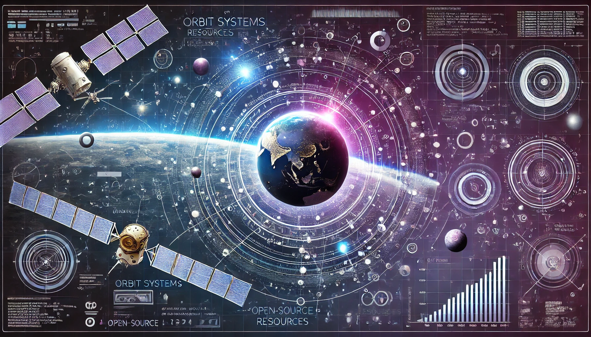

# SpaceResources
A list of useful resources for space mission design, visualisations, scripts and more. The focus is on free, open-source solutions.

## Orbit visualisers
* [Quick Web-Based orbit visualiser](https://orbitalmechanics.info/)

## Space Debris visualations
* [LeoLabs visualiser](https://platform.leolabs.space/visualization)

## Free courses
* [Orbital Mechanics with Python - free on YouTube](https://youtube.com/playlist?list=PLOIRBaljOV8gn074rWFWYP1dCr2dJqWab&si=cxbmqzfNNqwVozZL)
  * [Github Repo - Astrodynamics with Python - AWP](https://github.com/alfonsogonzalez/AWP)
* [Build a Cubesat - free on Youtube](https://youtube.com/@buildacubesat?si=3oTdnVCkyS1UhjHu)
* Gentry Lee videos on Systems Engineering
  * [Gentry Lee's - So You Want to be a Systems Engineer?](https://youtu.be/E6U_Ap2bDaE?si=HCgxD6N37XB2XAyF)
  * [Gentry Lee's - Systems Engineering When the Canvas Is Blank](https://youtu.be/3S5cgLxxZ14?si=g9-W5WY7kisidHbn)
* [Common Definitions of Systems Engineering- Space Systems Engineering 101 w/ NASA](https://youtu.be/rrBg-hTUM_Q?si=wnZTzlQ5YlFFIs2e)

## Astrodynamics packages
* [Astrodynamics with Python - AWP](https://github.com/alfonsogonzalez/AWP)

## Other useful master lists:
* [awesome-space](https://github.com/orbitalindex/awesome-space/blob/master/README.md)
* [awesome-astronomy](https://github.com/mbiesiad/awesome-astronomy)

## Newsletters
* [Payload Space](https://pyld.omeclk.com/portal/wts/ue%5EcnFeggqegg6mN%5E60yq8%7Cg-sPsvF0jOzTc)
* [Space Investor](https://thespaceinvestor.com/)
* 
