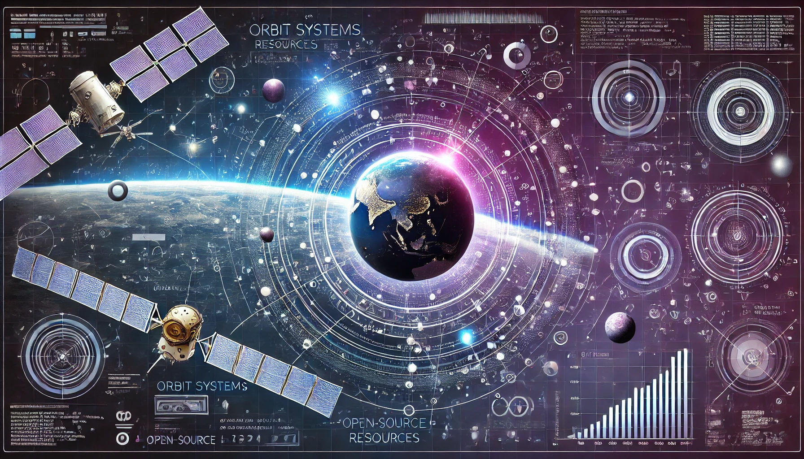

# SpaceResources
A curated list of useful resources for space mission design, space systems engineering, courses, visualisations, scripts and more. The focus is on free, open-source solutions. The list includes a range of fast, plain-english and web-based resources and more advanced ones.

---

## Table of Contents
- [Space Engineering 101](#space-engineering-101)
- [Full List of Resources](#full-list-of-resources)
  - [Orbit Visualisers](#orbit-visualisers)
  - [Space Object Trackers](#space-object-trackers)
  - [Free Courses](#free-courses)
    - [Orbital Mechanics](#orbital-mechanics)
    - [Space Environment](#space-environment)
    - [Systems Engineering](#systems-engineering)
    - [Spacecraft Subsystems](#spacecraft-subsystems)
    - [Mission Design](#mission-design)
  - [Software, Packages & Tools](#software-packages--tools)
    - [Astrodynamics & Simulation](#astrodynamics--simulation)
    - [Mission Analysis](#mission-analysis)
    - [Ground Segment & Communication](#ground-segment--communication)
    - [CAD & Structural](#cad--structural)
    - [Datasets](#datasets)
  - [Standards & References](#standards--references)
  - [Lunar Resources](#lunar-resources)
  - [CubeSat Resources](#cubesat-resources)
  - [Space Industry & News](#space-industry--news)
  - [Newsletters](#newsletters)
  - [Articles & Deep Dives](#articles--deep-dives)
  - [Communities & Forums](#communities--forums)
  - [Other Master Lists](#other-master-lists)

---

# Space Engineering 101
If you don't know much about space, orbits, or engineering, this is where you start.
* [Basic Orbit Shapes](https://youtu.be/pRvVK2m_wGE?si=6pnQ8IVz3JazXULe) - Orbits explained in plain English
* [Orbit Visualiser](https://orbitalmechanics.info/) - Quick web-based orbit visualiser, no install needed
* [LeoLabs](https://platform.leolabs.space/visualization), [SatelliteTracker3D](https://satellitetracker3d.com/) - See all satellites and debris in real time
* [Gentry Lee - Systems Engineering When the Canvas Is Blank](https://youtu.be/3S5cgLxxZ14?si=g9-W5WY7kisidHbn) - Learn how satellites are designed from scratch
* [How a Satellite Works (ESA)](https://www.esa.int/Enabling_Support/Space_Engineering_Technology/How_does_a_satellite_work) - A beginner-friendly overview of spacecraft subsystems
* [NASA's Beginner's Guide to Aeronautics](https://www.grc.nasa.gov/WWW/k-12/airplane/guided.htm) - Great foundation in aerospace physics
* [Sign up for these newsletters](#newsletters) to gradually infiltrate the space industry

---

# Full list of resources

## Orbit Visualisers
* [orbitalmechanics.info](https://orbitalmechanics.info/) - Interactive orbit shape visualiser (inclination, eccentricity, altitude)
* [Celestia](https://celestia.space/) - Free, open-source real-time 3D space simulation
* [Gpredict](http://gpredict.oz9aec.net/) - Real-time satellite tracking and orbit prediction (desktop)
* [OpenSpace](https://www.openspaceproject.com/) - Open-source astronomy interactive data visualisation
* [NASA Eyes on the Solar System](https://eyes.nasa.gov/) - Real-time 3D exploration of the solar system and NASA missions
* [Heavens-Above](https://www.heavens-above.com/) - Predict satellite passes, ISS visibility, and more for any location
* [Stuff in Space](https://stuffin.space/) - Real-time 3D visualisation of objects in Earth orbit

## Space Object Trackers
* [LeoLabs Visualiser](https://platform.leolabs.space/visualization) - Commercial-grade LEO object tracking
* [SatelliteTracker3D](https://satellitetracker3d.com/)
* [OrbTrack](https://www.orbtrack.org/) - Track any satellite with TLE data
* [KeepTrack](https://app.keeptrack.space/) - Open-source satellite tracking and space situational awareness tool
* [Space-Track.org](https://www.space-track.org/) - Official US DoD catalogue of all tracked space objects (free account required)
* [CelesTrak](https://celestrak.org/) - TLE data and satellite situation reports; trusted reference for orbital data
* [N2YO](https://www.n2yo.com/) - Track satellites and predict passes for any ground location
* ISS Trackers
  * [AstroViewer](https://www.astroviewer.net/iss/en/)
  * [ISSTracker](https://isstracker.pl/en)

## Free Courses

### Orbital Mechanics
* [Plain English: Basic Orbit Shapes](https://youtu.be/pRvVK2m_wGE?si=6pnQ8IVz3JazXULe) - Best starting point
* [Plain English: Orbital Mechanics by Nick Morgan](https://youtu.be/tJiAkBxuqfs?si=x1ahbnxIJg1Faupv)
* [Orbit Types by NSSI](https://youtu.be/BvjlBpP4zU8?si=3GGbxjtBLVI0Obvu) - LEO, MEO, GEO, HEO explained
* [Geometry of Parabolic and Hyperbolic Orbits](https://youtu.be/1-qehYJPUug?si=58UHMKfcntBF8Tro)
* [Orbital Mechanics with Python - YouTube Playlist](https://youtube.com/playlist?list=PLOIRBaljOV8gn074rWFWYP1dCr2dJqWab&si=cxbmqzfNNqwVozZL) - Full video series with code
  * [AWP GitHub Repo - Astrodynamics with Python](https://github.com/alfonsogonzalez/AWP)
* [Rocket Trajectory Optimization - YouTube by RocketPy](https://youtube.com/playlist?list=PLgcFtfzOxjA5CXDdKx6C8OQ_1ZsLLqwZW) - Simulation and trajectory planning
* [MIT OCW: Orbital Mechanics (Course 16.346)](https://ocw.mit.edu/courses/16-346-astrodynamics-fall-2008/) - Graduate-level astrodynamics lectures and notes

### Space Environment
* [Space Environment by NSSI](https://youtu.be/LIqPxnoprqY?si=wCd0R8S3H1LmbyYf) - Radiation, plasma, thermal vacuum
* [ESA Space Environment Information System (SPENVIS)](https://www.spenvis.oma.be/) - Web-based tool for modelling the space radiation environment
* [Space Weather at NOAA](https://www.swpc.noaa.gov/) - Real-time solar and geomagnetic activity data

### Systems Engineering
* [Build a CubeSat - YouTube Channel](https://youtube.com/@buildacubesat?si=3oTdnVCkyS1UhjHu) - End-to-end CubeSat design series
* Gentry Lee on Systems Engineering
  * [So You Want to be a Systems Engineer?](https://youtu.be/E6U_Ap2bDaE?si=HCgxD6N37XB2XAyF)
  * [Systems Engineering When the Canvas Is Blank](https://youtu.be/3S5cgLxxZ14?si=g9-W5WY7kisidHbn)
* [Common Definitions of Systems Engineering - NASA](https://youtu.be/rrBg-hTUM_Q?si=wnZTzlQ5YlFFIs2e)
* [MIT OCW: Introduction to Space Systems Engineering](https://ocw.mit.edu/courses/16-89j-space-systems-engineering-spring-2007/) - Full lecture notes, assignments
* [NASA Systems Engineering Handbook (SP-2016-6105)](https://www.nasa.gov/seh/) - The definitive NASA SE reference, free PDF
* [ESA's ECSS Standards (free)](https://ecss.nl/standards/) - European space engineering standards used across industry
* [Awesome Aerospace Engineering](https://github.com/mahran-sayed/awesome-aerospace-engineering) - Broad aerospace learning master list

### Spacecraft Subsystems
* **Attitude Determination & Control (ADCS)**
  * [Spacecraft Attitude Dynamics - YouTube by Euler's Method](https://youtu.be/oa_E2V8bFpI) - Intro to attitude representations
  * [CubeSat ADCS Overview - NASA CubeSat Launch Initiative](https://www.nasa.gov/smallsat-institute/sst-soa/guidance-navigation-and-control/) - State of the art overview
* **Propulsion**
  * [Plain English: Rocket Propulsion](https://youtu.be/7DB7-yOPkO8) - Tsiolkovsky equation and propulsion basics
  * [Electric Propulsion Overview - ESA](https://www.esa.int/Enabling_Support/Space_Engineering_Technology/Electric_propulsion)
* **Power Systems**
  * [Spacecraft Power Systems Overview - NSSI](https://youtu.be/8TUxNEbXOaQ) - Solar arrays, batteries, power budgets
* **Thermal Control**
  * [Spacecraft Thermal Control - NASA](https://tfaws.nasa.gov/online-resources/thermal-resources/) - NASA Thermal & Fluids Analysis Workshop materials
* **Communications**
  * [Link Budget Basics](https://youtu.be/Z-h4NkBpHJI) - How to calculate if your radio will work
  * [AMSAT: Introduction to Satellite Communications](https://www.amsat.org/education/)

### Mission Design
* [NASA Mission Design Introduction (YouTube)](https://youtu.be/xRkKo_yM-Ps) - Trade studies and concept of operations
* [Fundamentals of Astrodynamics (Bate, Mueller, White)](https://www.amazon.com/Fundamentals-Astrodynamics-Roger-Bate/dp/0486600610) - Classic textbook, very affordable; widely used as intro reference
* [GMAT Tutorials (NASA)](https://software.nasa.gov/software/GSC-17177-1) - Free mission analysis tool with tutorial mission scenarios

---

## Software, Packages & Tools

### Astrodynamics & Simulation
* [open-space-toolkit](https://github.com/open-space-collective/open-space-toolkit) - Collection of versatile C++/Python libraries for astrodynamics (orbits, frames, physics)
* [AWP - Astrodynamics with Python](https://github.com/alfonsogonzalez/AWP) - Python scripts for orbital mechanics problems with worked examples
* [Poliastro](https://github.com/poliastro/poliastro) - Pure Python astrodynamics library; great for quick orbit analysis
* [Orekit](https://www.orekit.org/) - Robust Java-based astrodynamics library backed by CNES; Python wrapper available
* [GMAT](https://software.nasa.gov/software/GSC-17177-1) - NASA's free General Mission Analysis Tool for trajectory design and optimization
* [OpenSpace](https://www.openspaceproject.com/) - Open-source interactive 3D space visualisation
* [Celestia](https://celestia.space/) - Real-time 3D space simulation (desktop)
* [RocketPy](https://github.com/RocketPy-Team/RocketPy) - Python-based 6-DOF rocket trajectory simulator

### Mission Analysis
* [STK (Systems Tool Kit) by AGI - Free Tier](https://www.ansys.com/products/missions/ansys-stk) - Industry-standard mission analysis software; free personal-use license available
* [GMAT](https://software.nasa.gov/software/GSC-17177-1) - Trajectory and manoeuvre design from low Earth orbit to interplanetary missions
* [Basilisk](https://hanspeterschaub.info/basilisk/) - Modular spacecraft simulation framework from CU Boulder; ADCS focused
* [42 Spacecraft Simulator (NASA)](https://software.nasa.gov/software/GSC-16720-1) - Multi-body spacecraft simulation

### Ground Segment & Communication
* [SatNOGS](https://satnogs.org/) - Open-source global network of satellite ground stations; download data from any CubeSat
* [GNU Radio](https://www.gnuradio.org/) - Open-source radio signal processing toolkit; widely used for satellite comms
* [GPredict](http://gpredict.oz9aec.net/) - Real-time satellite tracking; integrates with SDRs and rotator controllers
* [gr-satellites](https://github.com/daniestevez/gr-satellites) - GNU Radio decoders for satellite telemetry

### CAD & Structural
* [FreeCAD](https://www.freecad.org/) - Open-source parametric 3D modeller; useful for spacecraft structures
* [OpenVSP](https://openvsp.org/) - NASA's vehicle sketch pad for aerodynamic geometry design

### Datasets
* [awesome-spacecraft-engineering-datasets](https://github.com/patrickfleith/awesome-spacecraft-engineering-datasets) - Curated list of datasets for spacecraft engineering research and ML
* [NASA Open Data Portal](https://data.nasa.gov/) - Thousands of NASA datasets across missions, Earth science, and more
* [ESA Open Data](https://www.esa.int/About_Us/Digital_Agenda/Open_Data) - ESA mission data and catalogues
* [Space-Track.org](https://www.space-track.org/) - Full catalogue of tracked space objects with TLE data
* [CelesTrak](https://celestrak.org/) - TLE datasets, supplemental catalogue, and conjunction data messages

---

## Standards & References
Useful references for professional and serious hobbyist use.
* [NASA Systems Engineering Handbook (SP-2016-6105)](https://www.nasa.gov/seh/) - The gold standard SE handbook; free PDF download
* [ECSS Standards](https://ecss.nl/standards/) - European Cooperation for Space Standardization; free to download, widely required in European industry
* [SMAD - Space Mission Analysis and Design](https://www.smad.com/) - The industry "bible" for space mission design; not free but widely referenced
* [NASA Human Integration Design Handbook (HIDH)](https://humanresearchroadmap.nasa.gov/Evidence/reports/HIDH.pdf) - For crewed systems
* [NASA Technical Reports Server (NTRS)](https://ntrs.nasa.gov/) - Free access to thousands of NASA technical papers and reports
* [ESA Technical Memoranda](https://www.esa.int/Enabling_Support/Space_Engineering_Technology/TEC_Technical_Memos) - ESA internal technical knowledge base

---

## Lunar Resources
* [LSIC's Lunar Engineering 101](https://lsic.jhuapl.edu/Resources/Lunar-Engineering-101.php) - 8-part video series by the Lunar Surface Innovation Consortium for NASA; covers design considerations for lunar surface infrastructure
* [NASA Lunar Reconnaissance Orbiter Data](https://lunar.gsfc.nasa.gov/) - High-resolution lunar surface data and maps
* [Moon Trek (NASA)](https://trek.nasa.gov/moon/) - Web-based portal to explore lunar datasets and plan surface missions
* [Lunar ISRU Overview (ESA)](https://www.esa.int/Enabling_Support/Preparing_for_the_Future/Discovery_and_Preparation/In-Situ_Resource_Utilisation) - In-situ resource utilisation for Moon and Mars

---

## CubeSat Resources
A focused section for those building or studying small satellites.
* [CubeSat Design Specification (CDS)](https://www.cubesat.org/cubesatinfo) - The standard document defining CubeSat form factors (1U, 2U, 3U, 6U, 12U)
* [Build a CubeSat YouTube Channel](https://youtube.com/@buildacubesat?si=3oTdnVCkyS1UhjHu) - End-to-end design series
* [CubeSatSim](https://github.com/alanbjohnston/CubeSatSim) - Low-cost CubeSat emulator with UHF radio telemetry, solar panels, and 3D-printed frame
* [NASA CubeSat Launch Initiative (CSLI)](https://www.nasa.gov/smallsat-institute/csli/) - How to get your CubeSat launched for free via NASA
* [ESA's CubeSat Support Facility](https://www.esa.int/Enabling_Support/Operations/CubeSat_Support) - ESA resources and launch opportunities for CubeSats
* [LibreCube](https://librecube.org/) - Open-source CubeSat and space systems initiative
* [SatNOGS](https://satnogs.org/) - Open network to receive telemetry from your satellite post-launch
* [Awesome CubeSat](https://github.com/oygx210/Awesome-Cubesat) - Community-curated CubeSat resource list

---

## Space Industry & News
Stay current with the industry.
* [SpaceNews](https://spacenews.com/) - Authoritative industry news
* [NASASpaceFlight.com](https://www.nasaspaceflight.com/) - In-depth launch and mission coverage
* [Space.com](https://www.space.com/) - Broad space news for general and enthusiast audiences
* [The Planetary Society](https://www.planetary.org/) - Science-focused space exploration advocacy and news
* [SpaceX Mission Updates](https://www.spacex.com/updates/) - Direct updates from the most active launch provider

---

## Newsletters
Newsletters personally followed and recommended. Sign up to stay current.
* **High-level trends & industry**
  * [Payload Space](https://payloadspace.com/) - Daily briefings on the business of space
  * [Space Investor](https://thespaceinvestor.com/) - Investment and startup landscape
  * [Bloomberg Space Business](https://www.bloomberg.com/account/newsletters/business-of-space)
* **Technical & engineering**
  * [Orbital Index](https://orbitalindex.com/subscribe/) - Weekly curated links on space engineering and science
  * [Jatan's Space](https://jatan.space/) - Deep-dive writing on space exploration and science
  * [NASA Newsletter](https://lp.constantcontactpages.com/sl/7ThAX6O/signup) - Mission and agency updates
  * [ESA Bulletin](https://www.esa.int/ESA_Multimedia/ESA_Bulletins) - ESA's technical and programmatic updates

---

## Articles & Deep Dives
High-density articles on specific topics.

### Orbits & Mission Design
* [LEO vs. MEO vs. GEO Satellites: What's the Difference?](https://anywaves.com/resources/blog/leo-meo-geo-satellites-definition-difference/) - Clear breakdown of orbit regimes
* [Understanding Sun-Synchronous Orbits](https://earthobservatory.nasa.gov/features/OrbitsCatalog/page2.php) - NASA explainer on SSO and Earth observation orbits
* [Delta-V Budget: What It Means and Why It Matters](https://www.planetary.org/space-missions/what-is-delta-v) - Planetary Society explainer

### Spacecraft Design
* [How Do Spacecraft Survive the Thermal Extremes of Space?](https://www.esa.int/Enabling_Support/Space_Engineering_Technology/How_do_spacecraft_survive_the_thermal_extremes_of_space) - ESA thermal control overview
* [Power Budget for a CubeSat (Practical Guide)](https://www.cubesatshop.com/power-budget/) - Step-by-step power budgeting
* [Link Budget Explained](https://www.rfcafe.com/references/rf-design/link-budget.htm) - RF link margin calculations

### Space Sustainability & Debris
* [ESA's Space Debris Overview](https://www.esa.int/Safety_Security/Space_Debris/About_space_debris) - Comprehensive overview of the debris problem
* [Deorbit Regulations and Standards (IADC)](https://www.iadc-home.org/documents_public/view/id/82#u) - Inter-Agency Space Debris Coordination Committee guidelines

---

## Communities & Forums
Connect with practitioners, hobbyists, and researchers.
* [r/SpaceEngineers](https://www.reddit.com/r/spaceengineers/) - Game-based but inspires real interest
* [r/SpaceX](https://www.reddit.com/r/spacex/) - Detailed technical discussion of SpaceX missions
* [r/Satellite](https://www.reddit.com/r/satellite/) - Amateur satellite enthusiasts
* [AMSAT Forums](https://www.amsat.org/pipermail/amsat-bb/) - Amateur satellite operator community
* [Space Stack Exchange](https://space.stackexchange.com/) - Q&A for space exploration and engineering
* [NASA Community College Aerospace Scholars (NCAS)](https://www.nasa.gov/learning-resources/nasa-community-college-aerospace-scholars/) - Free programme connecting students with NASA engineers

---

## Other Master Lists
* [awesome-space](https://github.com/orbitalindex/awesome-space/blob/master/README.md) - The most comprehensive space resource list on GitHub
* [awesome-astronomy](https://github.com/mbiesiad/awesome-astronomy) - Astronomy tools, data, and learning resources
* [Awesome Aerospace Engineering](https://github.com/mahran-sayed/awesome-aerospace-engineering) - Broad aerospace engineering learning resources
* [Awesome-GIS](https://github.com/sshuair/awesome-gis) - Geospatial tools and data, with relevance to Earth observation satellites
* [awesome-spacecraft-engineering-datasets](https://github.com/patrickfleith/awesome-spacecraft-engineering-datasets) - Datasets for spacecraft engineering and ML research
